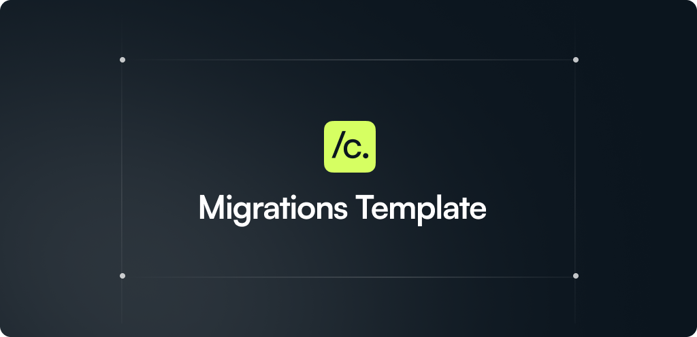

<div align="center">
   Codemods" />
</div>

> **Remove this section once the repo is customized**
> Framework/SDK maintainers: This template comes with setup guides, utilities, and a GitHub Action to help you and your community build and publish codemods with ease. Once you, the repo maintainers, approve codemod PRs, they’ll be automatically published as official codemods to the [Codemod Registry](https://app.codemod.com/registry) under your org scope. Check out the [Node.js codemods](https://codemod.link/nodejs-official) for an example. See [AUTO_PUBLISH_SETUP.md](.github/AUTO_PUBLISH_SETUP.md) for setup instructions.

This repository contains codemods for <FRAMEWORK_OR_SDK_NAME>. These codemods facilitate adopting new features and upgrading across breaking changes.


## Running codemods
> [!CAUTION]
> Codemods edit your code. Run them only on files tracked by Git, and make sure to commit or stash your changes first.

Run codemods from the registry by using the names defined in their codemod.yaml:
```bash
npx codemod@latest <codemod-name>
```
For example: 
```
npx codemod@latest @nodejs/tmpDir-to-tmpdir
```
See the [Codemod documentation](https://go.codemod.com/cli-docs) for a full list of available CLI commands and options.

## Contributing

See [CONTRIBUTING.md](./CONTRIBUTING.md).

## Security

See [SECURITY.md](./SECURITY.md).

## License

MIT


